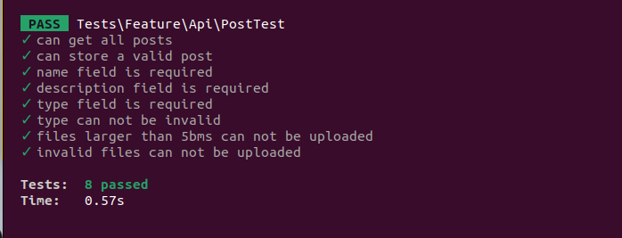
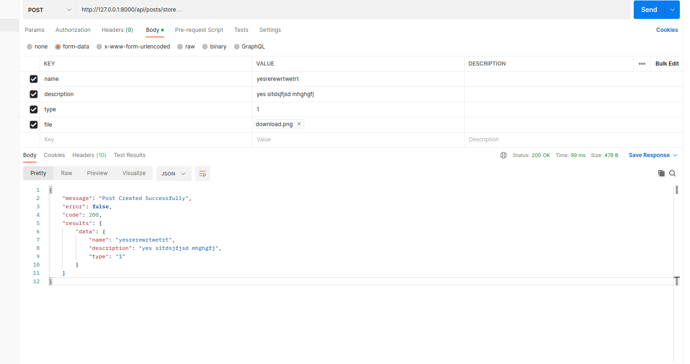

## Abby test

Does not include 
- docker containers.
- services.
- extensive API exceptional handler.

### Set Up and Installation

Clone the Repo
```sh
composer install
```

Run Composer install
```sh
composer install
```

### Testing

Run tests

```sh
vendor/bin/phpunit  or  php artisan test

```


### API endpoint

headers 
: Accepts  : application/json

List all Posts

```http
GET /api/posts
```
sample response

```json
{
"message": "List of all Posts",
"error": false,
"code": 200,
"results": {
"data": [
{
"name": "yesrerewrtwetrt",
"description": "yes sitdsjfjsd mhghgfj",
"type": "1"
},
{
"name": "yesrerewrtwetrt",
"description": "yes sitdsjfjsd mhghgfj",
"type": "1"
},
{
"name": "yesrerewrtwetrt",
"description": "yes sitdsjfjsd mhghgfj",
"type": "1"
},
{
"name": "yesrerewrtwetrt",
"description": "yes sitdsjfjsd mhghgfj",
"type": "1"
},
{
"name": "yesrerewrtwetrt",
"description": "yes sitdsjfjsd mhghgfj",
"type": "1"
}
]
}
}
```


Get a Single Post

```http
GET /api/posts/{postId}
```

sample response

```json
{
    "message": "Post Details",
    "error": false,
    "code": 200,
    "results": {
        "name": "yesrerewrtwetrt",
        "description": "yes sitdsjfjsd mhghgfj",
        "type": "1",
        "file": "http://127.0.0.1:8000/api/local/temp/files/63ad5a7c81689.png?expires=1672376061&signature=e030deeedcb3593b207e9a916c341261d674673377cf6b13b72bd2f46f7d7e6d"
    }
}
```


Save a Post

```http
POST /api/posts/save
```

Request


Sample Response
```json
{
"message": "Post Created Successfully",
    "error": false,
    "code": 200,
    "results": {
        "data": {
            "name": "yesrerewrtwetrt",
            "description": "yes sitdsjfjsd mhghgfj",
            "type": "1"
        }
    }
}

```

Delete old records and related files test command

```sh
php artisan delete:records
```

